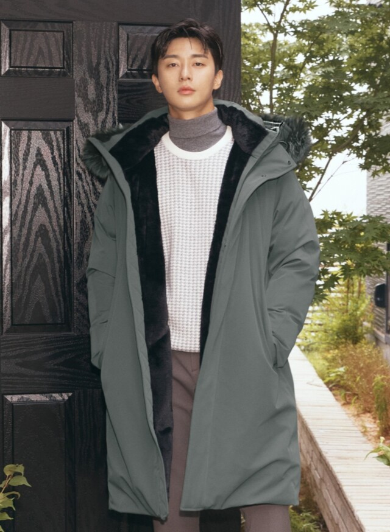

## 'card-ui-02'

<br>

### • 배포 주소: [https://card-ui-02.netlify.app/](https://card-ui-02.netlify.app/)

<br>

#### - 작업 기간: 2021.08

#### - 리팩토링: 2024.01

<br>

### 기술 스택

Development

<p>


</p>

Config

<p>
</a>
</p>

Environment

<p>
</a>
</a>
</a>
</p>
<br>

### 전체 페이지


<br><br>

### 💻 주요 기능

---

- flex, counter-increment, content: counter

```html
<div class="item">
  <div class="photo">
    <a href="#none">
      
      
    </a>
  </div>
  <div class="detail">
    <span class="price"
      ><b>77<small>%</small></b> 159,000원</span
    >
    <span class="name">폭스 퍼 구스다운 후드 롱패딩</span>
    <span class="count">상품평 110</span>
  </div>
</div>
```

```css
.items {
  display: flex;
  gap: 20px;
  counter-reset: item;
}
.item {
  height: 400px;
  position: relative;
  flex: 1;
}
.item:before {
  counter-increment: item;
  content: counter(item);
  position: absolute;
  background-color: rgb(91, 69, 192);
  width: 45px;
  height: 45px;
  top: 0;
  left: 0;
  z-index: 10;
  font-size: 18px;
  color: #fff;
  text-align: center;
  line-height: 45px;
  transition: 0.35s;
}
.item:hover:before {
  background-color: crimson;
}
```
